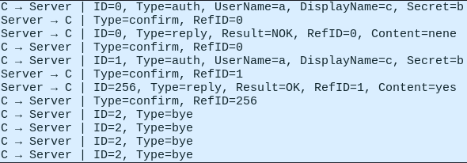
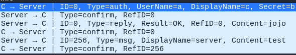
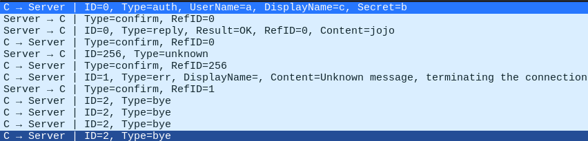
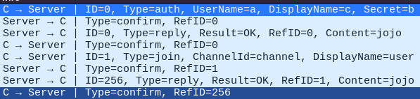
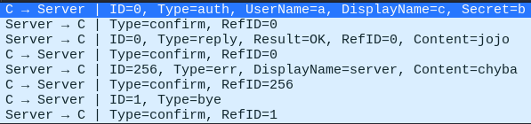
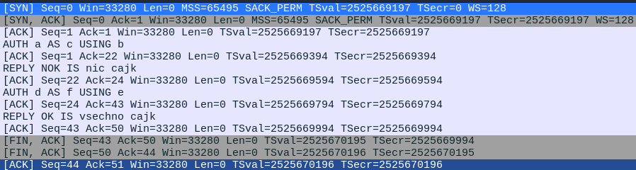
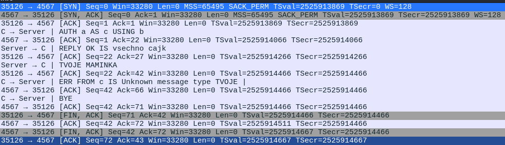
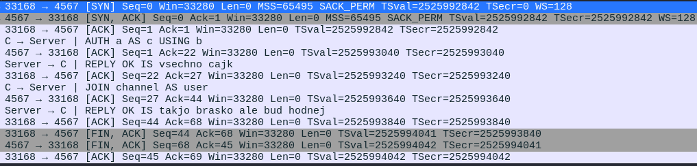
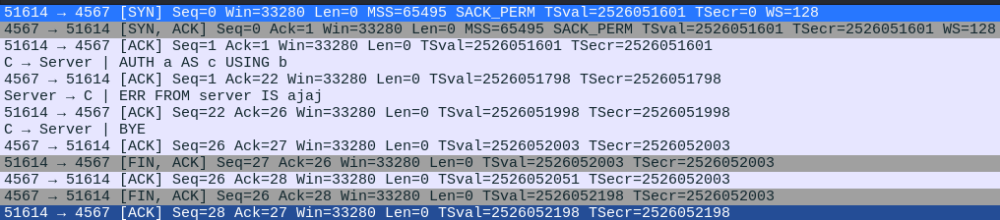
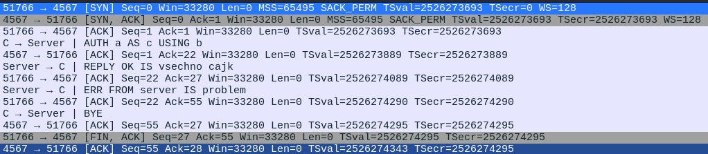

# IPK - first project - Client-chat

This is a simple chat application written in C++.

**Table of contents:**

- [IPK - first project - Client-chat](#ipk---first-project---client-chat)
  - [Theory](#theory)
  - [Implementation](#implementation)
    - [UDP communication](#udp-communication)
      - [Message confirmation tracking](#message-confirmation-tracking)
    - [TCP communication](#tcp-communication)
  - [Testing](#testing)
    - [UDP tests](#udp-tests)
    - [TCP tests](#tcp-tests)

# Theory

- ### TCP

  Transmission Control Protocol is a transport protocol that is used on top of IP (Internet Protocol) to ensure reliable
  transmission of packets over the internet or other networks. TCP is a connection-oriented protocol, which means that
  it establishes and maintains a connection between the two parties until the data transfer is complete. TCP provides
  mechanisms to solve problems that arise from packet-based messaging, e.g. lost packets or out-of-order packets,
  duplicate packets, and corrupted packets. TCP achieves this by using sequence and acknowledgement numbers, checksums,
  flow control, error control, and congestion control. [

- ### UDP

  User Datagram Protocol is a connectionless and unreliable protocol that provides a simple and efficient way to send
  and receive datagrams over an IP network. UDP does not guarantee delivery, order, or integrity of the data, but it
  minimizes the overhead and latency involved in transmitting data when compared to TCP. UDP is suitable for
  applications that require speed, simplicity, or real-time communication, such as streaming media, online gaming, voice
  over IP, or DNS queries.

***

# Implementation

Program begins by parsing command line arguments.

```c++
bool get_parameters(argc, argv, UDP);
```

Specifying host and protocol is necessary (-s, -t).
After completion, shared memory variable are initialized and program chooses behavior, depending on specified protocol.

 ```c++
 void tcp_behavior(pollfd fds[2], std::string &userInput, SharedVector *confirmation_vector, shm_vector *vector_UN, shm_vector *vector_DN, shm_vector *vector_CD);
 ```

 ```c++
 void udp_behavior(pollfd fds[2], std::string &userInput, SharedVector *confirmation_vector, shm_vector *vector_UN, shm_vector *vector_DN, shm_vector *vector_CD);
```

Program can be ended either by ```Ctrl-c``` command or ```/exit```
 ***

## UDP communication

Program starts by creating 2 processes with ```fork()```, which will be responsible for handling user chat and incoming
messages, using ```poll()```.
When the function returns a positive integer, child processes are created. These will decipher messages in accordance with the IPK24-CHAT protocol.

```c++
pid_t pid = fork();
if (pid == 0) {     
    if (!handle_chat(userInput, confirmation_vector, vector_UN, vector_DN, vector_CD)) {
        *chat = false;
    }
    userInput.clear();
    break;
}
```

```c++
pid = fork();
if (pid == 0) {
    int message_length = receive_message(server_address, client_socket, buf, len);
        if (!decipher_the_message(buf, message_length, confirmation_vector, server_address, client_socket, display_name))
            *listen_on_port = false;
        break;
}
```

***
```handle_chat()``` sends packets using functions provided in ```packets.cpp```. All types of packets derives
from ```struct Packets```

```c++
typedef struct Packets {
    uint8_t MessageType;
    uint16_t MessageID;

    Packets(uint8_t type, uint16_t id) {
        MessageType = type;
        MessageID = id;
    }

    virtual int construct_message(uint8_t *b) {
        memcpy(b, &this->MessageType, sizeof(this->MessageType));
        b += sizeof(this->MessageType);
        
        uint16_t ID = this->MessageID;
        memcpy(b, &ID, sizeof(ID));
        b += sizeof(ID);
        return 3;
    }

} Packet;
```

It provides basic attributes and methods, which will be overwritten by its child structures to serve their specific
purposes. ```construct_message()``` prepares buffer for sending over the network.
***
```decipher_the_message()``` retrieves the buffer from the network and depending on type of the message decides what to do next and
sends ```CONFIRM``` packets to the server.
***
### Message confirmation tracking

Vector of ```uint16_t``` values (``` SharedVector *confirmation_vector```) is created in the shared memory. When packet
is sent its id is written to this vector, followed by zero.
When message is confirmed, 1 is written instead of 0. When client gets ```REPLY``` to this packet, its id is deleted
from the vector.
***
## TCP communication
TCP communication has pretty the same logic, but doesn't use multiple processes. 
```c++
if (fds[0].revents && POLLIN) {//chat
    std::getline(std::cin, userInput);
    if (!userInput.empty()) {
        if (!handle_chat(userInput, confirmation_vector, vector_UN, vector_DN, vector_CD)) {
            *chat = false;
        }
        userInput.clear();
    }
} 
if (fds[1].revents && POLLIN) {//socket
    std::string Name = "default";
    if (!vector_DN->empty())
        Name = std::string(vector_DN->begin(), vector_DN->end());
    if (!receive_message_tcp(client_socket, buf, len, Name))
        *chat = false;
}
```
```handle_chat()``` sends messages in format defined in ABNF grammar for this project, using function from ```packets_tcp.cpp```.

```receive_message_tcp()``` takes messages from the network and process them depending on their type.
***
# Testing
***
I provided screenshots from Wireshark, where results of tests of basic chat functionality and some error cases can be seen.

All tests were conducted under this environment - https://git.fit.vutbr.cz/NESFIT/dev-envs.git?dir=ipk#c

## UDP tests
* Attempt to authenticate after ```!REPLY```, and trying to terminate the connection afterwards 



* Message from the server



* Error while authentication 


* Invalid command sent



* Common join command with ```/rename```



* Error from server 



***
## TCP tests

* Attempt to authenticate after ```!REPLY```



* Unknown command error



* Join to server



* Auth error



* Error from server 


***
## Bibliography

* Boost C++ libraries, documentation, available at: https://www.boost.org/doc/libs/1_47_0/doc/html/interprocess/sharedmemorybetweenprocesses.html
* Ing. Daniel Dolejška, Ing. Vladimír Veselý Ph.D., IPK lectures, [03.07.2024]
* A. S. Tanenbaum, "Computer Networks," 5th ed., Pearson, 2011, [03.15.2024]
* GeeksforGeeks. (n.d.). different articles [03.08.2024]; URL: https://www.geeksforgeeks.org/
* Habr. (n.d.) different articles [03.16.2024]; URL: https://www.habr.com
* Various online resources such as youtube.com, medium.com etc.